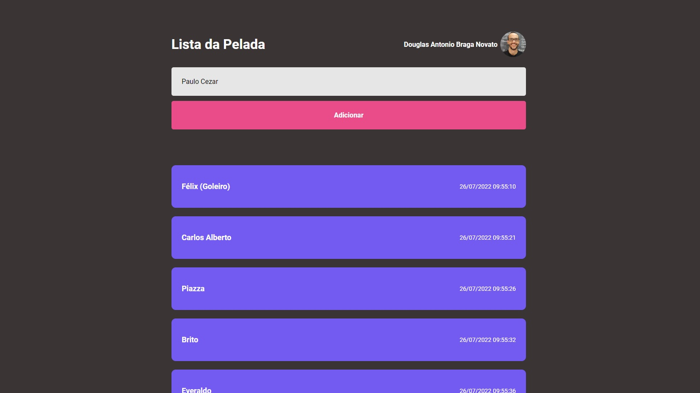

### Lista da Pelada

- criar lista da pelada pelo organizador, pouco antes de iniciar, na ordem de chegada.

#### Versão Lts

<h1 align="center">
    
</h1>

#### Tecnologias

- Reactjs, Hook
- HTML, CSS, Javascript
- API

#### Pontos Técnicos

- 1 Abertura
- 2 Introdução
- 3 Criando o projeto
- 4 Executando o projeto
- 5 Estrutura React
- 6 JSX
- 7 Estrutura de Pastas e Arquivos
- 8 Fragment
- 9 Importando arquivos Css
- 10 Separando Css
- 11 Estilizando Página Css
- 12 Importanto Fonte
- 13 Componentes
- 14 Propriedades
- 15 Estado
- 16 Imutabilidade
- 17 Key Prop
- 18 Hooks
- 19 Header
- 20 useEffect
- 21 Consumindo API
- 22 useEffect Async
- 23 Encerramento

#### Executar o projeto

- npm install na raiz do projeto
- npm run dev para rodar localhost na porta 5173

[Fonte do projeto](https://app.rocketseat.com.br/discover/course/especializar-react/especializar-react/encerramento-4)
Fonte do projeto: [Trilha Especializar - Rocketseat Discover](https://www.rocketseat.com.br/) 
